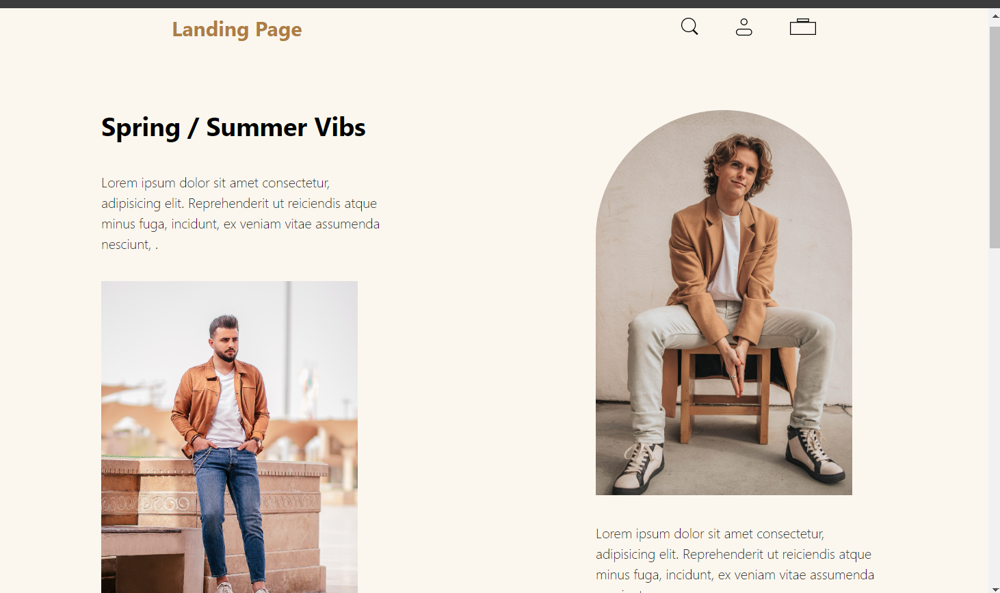
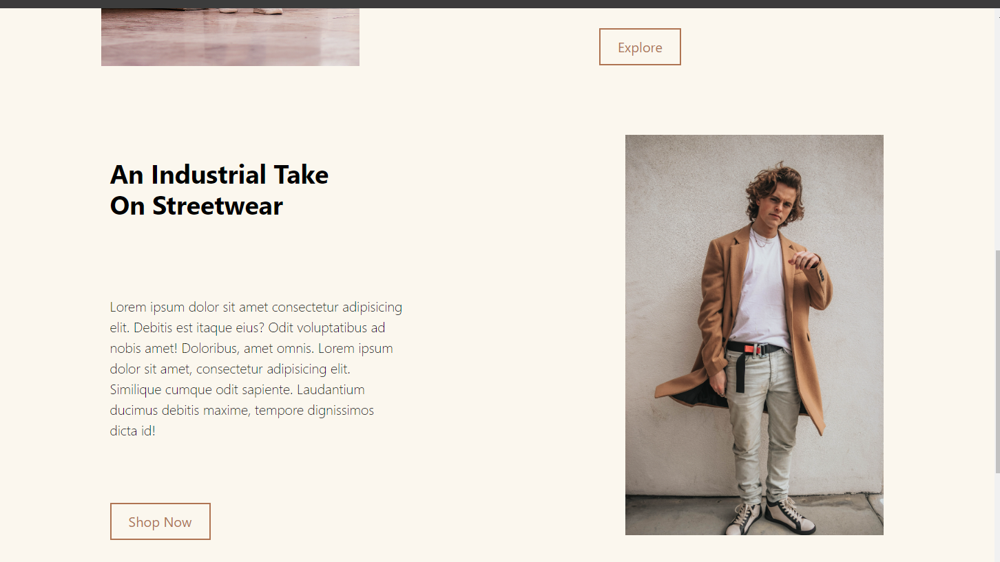

# Landing Page Project

I learned how to create a landing page using Tailwind CSS. This project helped me understand the basics of layout and styling.

## Screenshots

Here are some screenshots of the landing page:

1. 
2. 
3. 
